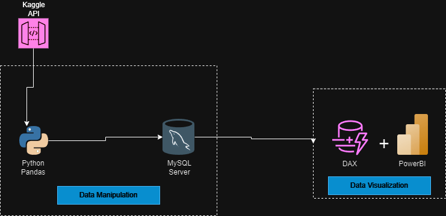

# Retail Data Engineering Project

## Introduction
This project delves into the world of retail data analytics using modern data engineering practices. We'll leverage tools like Pandas for data manipulation, MySQL for data warehousing, and Power BI for data visualization.

## Architecture

## Technology Used
- **Programming Language**: Python
- **Database**: MySQL
- **Data Visualization**: Power BI
- **Data Manipulation**: Pandas
- **APIs**: Kaggle API

## Dataset Used
**Retail Sales Data**: This dataset includes fields capturing sales transactions, product categories, regions, and more. The data is sourced from Kaggle.

- **[https://www.kaggle.com/datasets/sudhanshu1st/retail-store-orders-dataset](https://www.kaggle.com/)**

## Scripts for Project

### Extract Data
The data is extracted using the Kaggle API. The script connects to Kaggle, downloads the dataset, and saves it locally.

### Load Data
The cleaned and transformed data is loaded into a MySQL database for further analysis.
- **Script**: `Mysqlscript.sql`
- 
### Transform Data
Pandas is used to clean the data, add new features, and prepare it for loading into MySQL.

- **Script**: `retail-orders-notebook.py`

## Data Analysis and Visualization
Power BI and DAX are used for data analysis and visualization, providing insights into various metrics such as the highest selling products category-wise, region-wise, and sub-category-wise.
**

## Contribute
Feel free to contribute to this project by forking the repository and submitting a pull request.

- [GitHub Repository](https://github.com/Sudhanshu1st/retail-order-data-engineering-project)

## More Information
For more detailed information about the project and data, refer to the following resources:

- [Kaggle Dataset](https://www.kaggle.com/)
- [MySQL Documentation](https://dev.mysql.com/doc/)
- [Power BI Documentation](https://docs.microsoft.com/en-us/power-bi/)
